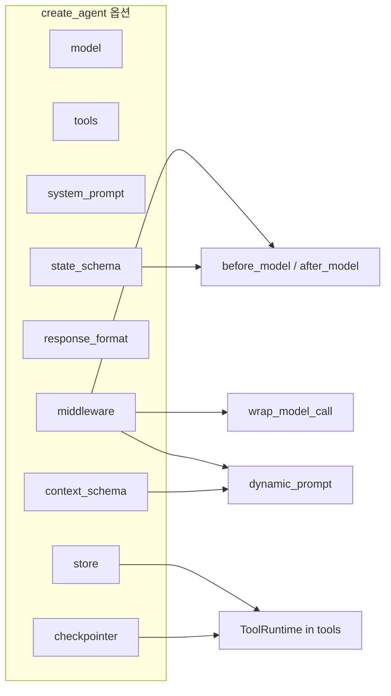

# LangChain `create_agent` 옵션 정리 (`feature/` 기준)

`langchain.agents.create_agent` 로 에이전트를 만들 때 `feature/` 에서 실제로 넘긴 인자와, 미들웨어·스키마 조합을 한곳에 모았습니다.

**참고**

- 공식·스킬: `.agents/skills/langchain-fundamentals/SKILL.md` (`create_agent` 섹션)
- 튜토리얼 노트북: `PART02-에이전트/Ch02-에이전트/01-LangGraph-Agents.ipynb`, `02-LangGraph-Tools.ipynb`
- `feature/` 는 `StateGraph` 직접 조립 예제(`feature/SimpleChatBot`, `feature/HumanIntheLoopUseCommandResume` 등)와 `create_agent` 예제가 섞여 있음 — **이 문서는 `create_agent` 만** 대상

---

## 한눈에 보기: `feature/`에서 쓰인 옵션

| 옵션              | 역할                                          | `feature/` 사용 파일                                      |
| ----------------- | --------------------------------------------- | --------------------------------------------------------- |
| `model`           | LLM (문자열 또는 `BaseChatModel` 인스턴스)    | **전부** (10개)                                           |
| `tools`           | `@tool` 목록 (`[]` 가능)                      | **전부**                                                  |
| `system_prompt`   | 에이전트 시스템 지시문                        | `ResponseFormat`, `ToolRuntime*` 4종                      |
| `middleware`      | 호출 전·후·모델 래핑 훅                       | `DynamicPrompt`, `DynamicModel`, `Middleware*` 3종        |
| `response_format` | Pydantic 구조화 출력 스키마                   | `ResponseFormat`                                          |
| `context_schema`  | `invoke(..., context=...)` 정적 컨텍스트 타입 | `DynamicPrompt`, `ToolRuntimeToolCallID`                  |
| `state_schema`    | `AgentState` 확장 상태 타입                   | `ToolRuntimeToolCallID`                                   |
| `checkpointer`    | 스레드별 상태 영속 (HITL·재개 등)             | `ToolRuntimeToolCallID` (활성), 나머지 ToolRuntime은 주석 |
| `store`           | 장기 메모리 (`ToolRuntime.store`)             | `ToolRuntimeStore`                                        |

`feature/` 에서는 아직 **`HumanInTheLoopMiddleware` + `create_agent`** 조합은 없음 (HITL은 `StateGraph` + `interrupt` 예제).

---

## 파일별 옵션 매트릭스

| 파일                           | 클래스                           |  model  | tools | system_prompt |           middleware            | response_format | context_schema | state_schema | checkpointer | store  |
| ------------------------------ | -------------------------------- | :-----: | :---: | :-----------: | :-----------------------------: | :-------------: | :------------: | :----------: | :----------: | :----: |
| `ResponseFormat.py`            | `ResponseFormatAgent`            |    ✓    | `[]`  |       ✓       |                —                |        ✓        |       —        |      —       |      —       |   —    |
| `MiddlewareClassSimple.py`     | `MiddlewareClassSimpleAgent`     |    ✓    | `[]`  |       —       |      `CustomMiddleware()`       |        —        |       —        |      —       |      —       |   —    |
| `MiddlewareAnnotaionSimple.py` | `MiddlewareAnnotaionSimpleAgent` |    ✓    | `[]`  |       —       | `@before_model`, `@after_model` |        —        |       —        |      —       |      —       |   —    |
| `MiddlewareModelRetry.py`      | `MiddlewareModelRetryAgent`      |    ✓    | `[]`  |       —       |       `@wrap_model_call`        |        —        |       —        |      —       |      —       |   —    |
| `DynamicModel.py`              | `DynamicModelAgent`              |    ✓    | `[]`  |       —       |       `@wrap_model_call`        |        —        |       —        |      —       |      —       |   —    |
| `DynamicPrompt.py`             | `DynamicPromptAgent`             |    ✓    | `[]`  |       —       |        `@dynamic_prompt`        |        —        |       ✓        |      —       |      —       |   —    |
| `ToolRuntimeContext.py`        | `ToolRuntimeAgent`               | ✓(위치) |  3개  |       ✓       |                —                |        —        |       ✓        |    (주석)    |    (주석)    |   —    |
| `ToolRuntimeToolCallID.py`     | `ToolRuntimeAgent`               | ✓(위치) |  2개  |       ✓       |                —                |        —        |       ✓        |      ✓       |      ✓       |   —    |
| `ToolRuntimeStore.py`          | `ToolRuntimeAgent`               | ✓(위치) |  2개  |       ✓       |                —                |        —        |     (주석)     |    (주석)    |    (주석)    |   ✓    |
| `ToolRuntimeStreamWriter.py`   | `ToolRuntimeAgent`               | ✓(위치) |  1개  |       ✓       |                —                |        —        |     (주석)     |    (주석)    |    (주석)    | (주석) |

---

## 옵션별 설명

### `model` (필수에 가깝음)

- **타입:** `str` (`"openai:gpt-4o-mini"`) 또는 `BaseChatModel`
- **관례:** `feature/` 대부분은 `init_chat_model(...)` 결과를 `model=self._llm` 으로 전달
- **예외:** `ToolRuntime*.py` 는 첫 인자로 위치 인자 `create_agent(self._llm, ...)` 사용 (동작은 동일)

```python
from langchain.chat_models import init_chat_model
from langchain.agents import create_agent

llm = init_chat_model("openai:gpt-4o-mini")
agent = create_agent(model=llm, tools=[])
```

---

### `tools`

- **타입:** `list` of `@tool` 함수 / `BaseTool`
- **빈 리스트:** 미들웨어·구조화 출력만 보는 데모에서 `tools=[]` 로 루프만 구성 (`Middleware*`, `Dynamic*`, `ResponseFormat`)

---

### `system_prompt`

- **타입:** `str`
- **용도:** 에이전트 전역 지시 (이메일 추출, ToolRuntime 데모의 기본 역할 등)
- **참고:** `DynamicPrompt` 는 `@dynamic_prompt` 미들웨어가 **런타임에** 시스템 프롬프트 문자열을 바꾸므로, `create_agent` 에 `system_prompt` 를 넘기지 않음

```python
# feature/ResponseFormat.py
agent = create_agent(
    model=self._llm,
    system_prompt="Extract useful information from the email.",
    tools=[],
    response_format=ResponseFormat,
)
```

---

### `middleware`

- **타입:** `list[AgentMiddleware]` (데코레이터로 만든 훅, 클래스 인스턴스, 내장 미들웨어)
- **`feature/` 패턴:**

| 미들웨어                         | 파일                        | 훅             | 하는 일                                                           |
| -------------------------------- | --------------------------- | -------------- | ----------------------------------------------------------------- |
| `AgentMiddleware` 서브클래스     | `MiddlewareClassSimple`     | `before_model` | `CustomState.user_preferences` 로깅                               |
| `@before_model` / `@after_model` | `MiddlewareAnnotaionSimple` | 모델 전·후     | 메시지 로깅, 마지막 사용자 메시지 재작성                          |
| `@wrap_model_call`               | `MiddlewareModelRetry`      | 모델 호출 래핑 | 실패 시 최대 N회 재시도                                           |
| `@wrap_model_call`               | `DynamicModel`              | 모델 호출 래핑 | 메시지 길이에 따라 basic/advanced 모델 전환                       |
| `@dynamic_prompt`                | `DynamicPrompt`             | 프롬프트 생성  | `context` 의 `prompt_type`, `length` 로 시스템 프롬프트 동적 생성 |

```python
# feature/MiddlewareClassSimple.py
agent = create_agent(
    model=self._llm,
    tools=[],
    middleware=[CustomMiddleware()],
)
```

---

### `response_format`

- **타입:** Pydantic `BaseModel` 서브클래스
- **결과:** `invoke` 반환값의 `structured_response` 키에 검증된 객체
- **예:** `feature/ResponseFormat.py` — 이메일 발신자·주소 필드

```python
result = agent.invoke({"messages": [{"role": "user", "content": "From: ..."}]})
result["structured_response"]  # ResponseFormat 인스턴스
```

---

### `context_schema`

- **타입:** `TypedDict` 또는 Pydantic `BaseModel` 등 — `invoke(..., context={...})` 에 넣을 정적 컨텍스트 스키마
- **예:** `DynamicPromptContext` (`prompt_type`, `length`), `CustomContext` (`user_id`, `user_preferences`)
- **연계:** `@dynamic_prompt` / `ToolRuntime` 의 `runtime.context` 에서 읽음

```python
# feature/DynamicPrompt.py
agent = create_agent(
    model=self._llm,
    tools=[],
    middleware=[user_role_prompt],
    context_schema=DynamicPromptContext,
)
# g.invoke({"messages": [...]}, context={"prompt_type": "sns", "length": 50})
```

---

### `state_schema`

- **타입:** `AgentState` 를 확장한 클래스 (`messages` + 커스텀 필드)
- **용도:** 미들웨어·도구에서 `state` 필드 타입·리듀서 정의
- **예:** `ToolRuntimeToolCallID.CustomState` — `user_preferences` 등

```python
# feature/ToolRuntimeToolCallID.py
agent = create_agent(
    self._llm,
    tools=[...],
    system_prompt=_SYSTEM_PROMPT,
    checkpointer=InMemorySaver(),
    context_schema=CustomContext,
    state_schema=CustomState,
)
```

---

### `checkpointer`

- **타입:** `BaseCheckpointSaver` (예: `InMemorySaver()`)
- **용도:** `thread_id` 별 대화 상태 유지, HITL `interrupt` 후 `Command(resume=...)` 재개
- **`feature/`:** `ToolRuntimeToolCallID` 만 활성; 다른 ToolRuntime 파일은 주석 처리된 예시로 남김
- **호출 시:** `config={"configurable": {"thread_id": "..."}}` 필요

---

### `store`

- **타입:** LangGraph `BaseStore` (예: `InMemoryStore()`)
- **용도:** 도구의 `runtime: ToolRuntime` → `runtime.store` 로 네임스페이스 키-값 저장
- **예:** `ToolRuntimeStore` — `get_user_info` / `save_user_info`

```python
# feature/ToolRuntimeStore.py
agent = create_agent(
    self._llm,
    tools=[get_user_info, save_user_info],
    system_prompt=_SYSTEM_PROMPT,
    store=InMemoryStore(),
)
```

---

## `feature/`에 없지만 스킬·문서에 나오는 옵션

| 옵션                                        | 용도                      | 비고                                                |
| ------------------------------------------- | ------------------------- | --------------------------------------------------- |
| `checkpointer` + `HumanInTheLoopMiddleware` | 위험 툴 실행 전 사람 승인 | `langchain-middleware` 스킬 — **checkpointer 필수** |
| (모델 단) `with_structured_output`          | 에이전트 없이 구조화 출력 | `ResponseFormat` 과 대안 — `langchain-fundamentals` |

---

## 공통 호출 패턴 (`feature/`)

`BaseGraph` 서브클래스는 `_compile_graph()` 안에서 `create_agent` 를 호출하고, 반환 그래프를 `CompiledStateGraph` 로 캐스팅합니다.

```python
from typing import cast
from langgraph.graph.state import CompiledStateGraph

agent = create_agent(...)
return cast(CompiledStateGraph, agent)
```

외부 사용:

```python
g = ResponseFormatAgent()  # 또는 DynamicPromptAgent() 등
g.invoke({"messages": [...]}, config=..., context=...)
g.stream(...)
g.show_graph()
```

---

## 미들웨어 훅 ↔ `create_agent` 관계 (요약)



---

_마지막 동기화: `feature/` 내 `create_agent(` 호출 10곳 기준 (2026-05)._
