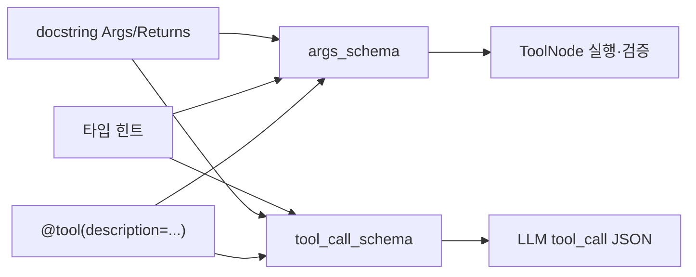

# LangChain `@tool(parse_docstring=True)` — docstring에서 툴 스키마 만들기

LangChain의 `@tool` 데코레이터에 `parse_docstring=True`를 주면, 함수 **docstring**을 파싱해 LLM이 보는 **JSON Schema**(Pydantic `args_schema` / `tool_call_schema`)에 **파라미터 설명**을 자동으로 넣을 수 있습니다.

Deep Agent 튜토리얼(`write_todos`, `read_todos` 등)에서 LLM이 `todos` 같은 인자를 **무엇을 어떻게 채워야 하는지** 이해하도록 돕는 핵심 옵션입니다.

**참고**

- 노트북: `deep_agents_from_scratch/notebooks/02-deep_agent_todo_graph.ipynb` (도구 설계 · `parse_docstring` 설명 셀)
- 구현: `deep_agents_from_scratch/todo_tools.py`, `file_tools.py`, `research_tools.py`
- 프롬프트 상수: `deep_agents_from_scratch/prompts.py` (`WRITE_TODOS_DESCRIPTION` 등)
- 연관: [LangGraph-Tool-Injection.md](./LangGraph-Tool-Injection.md) (`InjectedState` 등으로 LLM 스키마에서 빠지는 인자)

---

## 한눈에 보기

| 항목                   | `parse_docstring=False` (기본)          | `parse_docstring=True`                      |
| ---------------------- | --------------------------------------- | ------------------------------------------- |
| 툴 전체 설명           | docstring 첫 줄 또는 `description=`     | 동일 규칙 + `Args`/`Returns` 파싱           |
| 파라미터 `description` | 타입 힌트·필드명만으로는 빈약할 수 있음 | docstring `Args:` 항목이 필드 설명으로 반영 |
| 권장 docstring 형식    | 자유 형식                               | **Google Style** (`Args:`, `Returns:`)      |
| LLM 노출 스키마        | `tool_call_schema`                      | 주입(`Injected*`) 인자는 여전히 **제외**    |

---

## 동작 과정 (4단계)

`parse_docstring=True`일 때 LangChain은 대략 다음 순서로 처리합니다.

1. **docstring 전체 읽기**  
   함수 본문 바로 아래 `""" ... """` 블록을 통째로 가져옵니다.

2. **Google Style 섹션 탐지**  
   파이썬 생태계의 여러 docstring 규약 중 **Google Style**을 기준으로 `Args:`, `Returns:` 같은 섹션 헤더를 찾습니다.  
   (`Args:` 앞뒤 공백·대소문자는 관례적으로 `Args:` 형태를 맞추는 것이 안전합니다.)

3. **파라미터 ↔ 설명 매핑**  
   `Args:` 아래 각 줄에서 `이름: 설명`을 추출합니다.  
   예: `todos: List of Todo items with content and status` → 스키마의 `todos` 필드 `description`.

4. **스키마에 병합**  
   함수 **타입 힌트**로 만든 Pydantic 모델에 docstring에서 뽑은 설명을 붙여, 모델이 툴 호출 JSON을 생성할 때 참고하는 스키마를 완성합니다.

### 최소 예시

```python
from langchain_core.tools import tool

@tool(parse_docstring=True)
def example_function(name: str, age: int) -> str:
    """사용자 정보를 처리합니다.

    Args:
        name: 사용자의 이름
        age: 사용자의 나이

    Returns:
        처리 결과 문자열
    """
    return f"{name}, {age}"
```

위 docstring이 있으면 `name`, `age` 각각의 **필드 설명**이 `tool_call_schema` / `args_schema`에 포함됩니다.  
툴 **전체 설명**(모델에게 보이는 tool description)은 보통 docstring **첫 문단(요약)** 이 됩니다.

---

## Google Style docstring 작성법

### 권장 구조

```text
한 줄 요약 (툴 description 후보).

필요하면 여러 줄 본문 설명.

Args:
    param_a: LLM·개발자가 읽을 파라미터 설명
    param_b: 두 번째 파라미터 설명

Returns:
    반환값 설명 (선택)
```

### 규칙 요약

| 규칙                  | 설명                                                                |
| --------------------- | ------------------------------------------------------------------- |
| `Args:` 아래 들여쓰기 | 각 인자는 보통 4칸 들여쓰기 후 `이름: 설명`                         |
| 이름 일치             | `Args:`의 이름은 **함수 시그니처 파라미터명**과 동일해야 매핑됨     |
| 타입                  | **타입은 시그니처 힌트**가 우선 (`list[Todo]`, `Annotated[...]` 등) |
| `Returns:`            | 실행·검증용 문서에 반영; LLM `tool_call_schema`에는 보통 영향 적음  |

### 이 레포의 실제 패턴 (`write_todos`)

```python
@tool(description=WRITE_TODOS_DESCRIPTION, parse_docstring=True)
def write_todos(
    todos: list[Todo],
    tool_call_id: Annotated[str, InjectedToolCallId],
) -> Command:
    """Create or update the agent's TODO list for task planning and tracking.

    Args:
        todos: List of Todo items with content and status
        tool_call_id: Tool call identifier for message response

    Returns:
        Command to update agent state with new TODO list
    """
    ...
```

- **`description=WRITE_TODOS_DESCRIPTION`**: 툴 **전체** 사용법·모범 사례는 `prompts.py`의 긴 마크다운 문자열로 고정 (노트북에서 `show_prompt`로 확인).
- **`parse_docstring=True`**: LLM이 JSON으로 넘길 **`todos` 필드**에 docstring `Args` 설명을 붙임.

---

## `description=` vs docstring — 무엇이 어디에 쓰이나

두 소스가 **역할이 겹치지 않게** 쓰이는 패턴이 Deep Agent 코드베이스의 표준입니다.

| 소스                     | 반영 위치                            | 예 (`write_todos`)                             |
| ------------------------ | ------------------------------------ | ---------------------------------------------- |
| `@tool(description=...)` | 툴 **전체** `description`            | `WRITE_TODOS_DESCRIPTION` 전문                 |
| docstring **첫 줄·요약** | `description=` **없을 때만** 툴 설명 | `read_todos`의 "Read the current TODO list..." |
| docstring **`Args:`**    | 각 **파라미터** `description`        | `todos: List of Todo items...`                 |
| 타입 힌트                | JSON Schema `type`, `items`, `$ref`  | `list[Todo]` → `Todo` 객체 배열                |

**실측 예** (동일 시그니처로 재현 가능):

```python
# write_todos: description= 지정
# → tool_call_schema["description"] == "외부 description 문자열"
# → properties["todos"]["description"] == "List of Todo items with content and status"
# → tool_call_id는 LLM 스키마에 없음 (InjectedToolCallId)

# read_todos: description= 없음, parse_docstring만
# → tool_call_schema["description"] == docstring 요약문
# → properties == {}  (state, tool_call_id 모두 주입)
# → args_schema에는 state, tool_call_id 설명이 docstring에서 채워짐
```

스키마 확인 스니펫:

```python
from deep_agents_from_scratch.todo_tools import write_todos

print(write_todos.description)
print(write_todos.tool_call_schema.model_json_schema())
print(write_todos.args_schema.model_fields["todos"].description)
```

---

## LLM 스키마 vs 실행용 전체 스키마

[LangGraph-Tool-Injection.md](./LangGraph-Tool-Injection.md)와 같이, **같은 툴**이라도 스키마 종류에 따라 필드가 다릅니다.

| 스키마                  | 용도                               | `parse_docstring` 반영                          |
| ----------------------- | ---------------------------------- | ----------------------------------------------- |
| `tool.tool_call_schema` | 모델이 생성하는 **tool_call JSON** | **LLM이 채우는 인자** + 해당 필드 `description` |
| `tool.args_schema`      | 런타임 검증·실행                   | **전체 시그니처** + `Injected*` 인자 설명까지   |

`parse_docstring=True`여도 `Annotated[..., InjectedToolCallId]` / `InjectedState` 등은 **`tool_call_schema`에서 제외**됩니다.  
다만 `args_schema`에는 docstring `Args` 설명이 남아, 개발·디버깅 시 일관된 문서가 됩니다.



---

## 생성되는 JSON Schema 모습 (개념)

`write_todos` + `parse_docstring=True`일 때 LLM이 보는 쪽은 대략 다음과 같습니다 (`tool_call_id` 제외).

```json
{
  "title": "write_todos",
  "description": "<WRITE_TODOS_DESCRIPTION 전문 또는 요약>",
  "type": "object",
  "properties": {
    "todos": {
      "type": "array",
      "description": "List of Todo items with content and status",
      "items": { "$ref": "#/$defs/Todo" }
    }
  },
  "required": ["todos"]
}
```

`read_todos`처럼 **모든 인자가 주입**이면 `properties`는 `{}`이고, 툴 설명만 docstring 요약으로 전달됩니다.  
이 경우 LLM은 **인자 없이** 툴 이름만 호출하면 됩니다.

---

## `description=` + `parse_docstring` 조합이 유리한 이유

노트북 `02-deep_agent_todo_graph`에서는 `WRITE_TODOS_DESCRIPTION`을 `show_prompt`로 먼저 보여 줍니다. 내용은 다음을 포함합니다.

- **언제** 쓸지 (다단계 작업, 사용자가 todo 요청 등)
- **구조** (`content`, `status`, `id`)
- **모범 사례** (동시 `in_progress` 하나, 전체 목록 갱신 등)

이 긴 가이드는 `@tool(description=...)`에 두고, docstring `Args`에는 **스키마 필드 단위** 설명만 두면:

1. 시스템·툴 프롬프트와 JSON Schema가 **역할 분리**되고
2. docstring을 짧게 유지하면서도 **필드 레벨** 힌트는 유지할 수 있습니다.

---

## 자주 하는 실수

| 실수                                                 | 결과                                                                                           |
| ---------------------------------------------------- | ---------------------------------------------------------------------------------------------- |
| `Args:` 이름 ≠ 시그니처 파라미터명                   | 해당 필드 `description` 누락                                                                   |
| `parse_docstring=True`인데 `Args:` 없음              | 타입만 있는 빈 설명 스키마                                                                     |
| `description=`와 docstring 요약이 **서로 다른 정책** | 팀원 혼란 (하나를 source of truth로 정하기)                                                    |
| 주입 인자를 `Args`에서 빼 버림                       | `args_schema` 문서·실제 시그니처 불일치 ([Tool Injection](./LangGraph-Tool-Injection.md) 참고) |
| NumPy / Sphinx 스타일만 사용                         | Google Style 파서가 `Args:`를 못 찾을 수 있음                                                  |

---

## 체크리스트 (툴 추가 시)

- [ ] LLM이 채우는 인자는 docstring `Args:`에 **한 줄 이상** 설명
- [ ] 긴 사용 가이드는 `prompts.py` + `@tool(description=...)` 로 분리 검토
- [ ] `InjectedState` / `InjectedToolCallId` / `InjectedToolArg`는 [Tool Injection](./LangGraph-Tool-Injection.md) 문서대로 `Annotated` 선언
- [ ] 노트북·디버깅 시 `tool_call_schema.model_json_schema()`로 LLM 노출 필드 확인
- [ ] `show_prompt(description)`과 스키마 설명이 **모순되지 않는지** 확인

---

## import 치트시트

```python
from typing import Annotated

from langchain_core.tools import InjectedToolCallId, tool
from langgraph.prebuilt import InjectedState
from langgraph.types import Command
```

---

## 관련 소스

| 파일                | `parse_docstring` 사용                          |
| ------------------- | ----------------------------------------------- |
| `todo_tools.py`     | `write_todos`, `read_todos`                     |
| `file_tools.py`     | `read_file`, `write_file` (+ `description=`)    |
| `research_tools.py` | `tavily_search` 등                              |
| `prompts.py`        | `WRITE_TODOS_DESCRIPTION`, `*_DESCRIPTION` 상수 |
