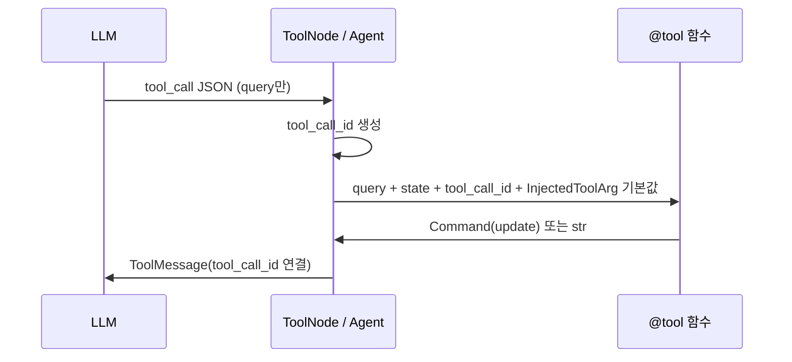

# LangGraph / LangChain 툴 인자 주입 (Tool Injection)

LangChain·LangGraph에서 `@tool` 함수의 일부 파라미터는 **LLM이 채우는 인자가 아니라**, 실행 시점에 **프레임워크가 자동으로 주입**합니다.  
`Annotated[타입, 마커]` 형태로 선언하면, LLM에게 노출되는 **툴 스키마**(`tool_call_schema`)에서 해당 인자가 빠지고 `ToolNode` / 에이전트 런타임이 값을 넣습니다.

**참고**

- 노트북: `deep_agents_from_scratch/notebooks_original/05-DeepAgents-Full-Version.ipynb` (`tavily_search`)
- 노트북: `deep_agents_from_scratch/notebooks/01-AgentState.ipynb` (State Injection 섹션)
- 구현: `deep_agents_from_scratch/research_tools.py`, `file_tools.py`, `todo_tools.py`, `task_tool.py`
- 예제: `feature/graph/UpdateStateUseCommand.py` (`human_review` + HITL)

---

## 한눈에 보기

| 마커                 | 패키지                 | 주입 내용                                | LLM `tool_call_schema` |
| -------------------- | ---------------------- | ---------------------------------------- | ---------------------- |
| `InjectedState`      | `langgraph.prebuilt`   | 현재 그래프 **state** 전체               | 제외                   |
| `InjectedToolCallId` | `langchain_core.tools` | 현재 툴 호출 **고유 ID**                 | 제외                   |
| `InjectedToolArg`    | `langchain_core.tools` | 개발자가 정한 **런타임 인자**(기본값 등) | 제외                   |

```python
from typing import Annotated
from typing_extensions import Literal

from langchain_core.messages import ToolMessage
from langchain_core.tools import InjectedToolArg, InjectedToolCallId, tool
from langgraph.prebuilt import InjectedState
from langgraph.types import Command

from deep_agents_from_scratch.state import DeepAgentState
```

---

## LLM이 보는 스키마 vs 실행 시 전체 인자

같은 툴이라도 스키마 종류에 따라 필드가 다릅니다.

```python
# tavily_search 와 동일한 시그니처의 가상 툴
@tool
def tavily_search(
    query: str,
    state: Annotated[DeepAgentState, InjectedState],
    tool_call_id: Annotated[str, InjectedToolCallId],
    max_results: Annotated[int, InjectedToolArg] = 1,
    topic: Annotated[Literal["general", "news", "finance"], InjectedToolArg] = "general",
) -> Command:
    ...
```

| 스키마                                    | 용도                      | LLM에 노출되는 필드 (예)                                 |
| ----------------------------------------- | ------------------------- | -------------------------------------------------------- |
| `tool.tool_call_schema`                   | 모델이 툴 호출 JSON 생성  | `query` 만                                               |
| `tool.args_schema` / `get_input_schema()` | 실행·검증용 전체 시그니처 | `query`, `state`, `tool_call_id`, `max_results`, `topic` |

즉 `Injected*` 마커는 **모델이 호출할 때 채우지 않는 인자**임을 선언하고, `InjectedToolArg`로 표시한 `max_results`·`topic`은 **함수 기본값**이 런타임에 주입됩니다. LLM은 `query`만 넘기면 됩니다.

---

## `InjectedState`

그래프 **상태 객체**를 툴 안에서 읽거나 수정할 때 사용합니다. LLM은 `state`를 만들 수 없으므로 스키마에서 제외합니다.

**주입 시점**: `ToolNode`(또는 `create_agent` 내부 툴 실행기)가 현재 스레드의 state 스냅샷을 넘깁니다.

```python
@tool
def ls(state: Annotated[DeepAgentState, InjectedState]) -> list[str]:
    """가상 파일시스템의 파일 목록."""
    return list(state.get("files", {}).keys())
```

**전형적 용도**

- `files` 읽기/쓰기 (`read_file`, `write_file`, `tavily_search` 결과 저장)
- `todos` 조회 (`read_todos`)
- 서브에이전트에 넘길 `files`·`todos` 복사 (`task_tool.task`)

**01-AgentState.ipynb 요약**

- 문제: LLM은 현재 `state`를 인자로 생성·전달할 수 없음
- 해결: `Annotated[CalcState, InjectedState]`로 런타임 주입
- `ToolNode`가 실행 직전에 `state`를 꽂아 줌

---

## `InjectedToolCallId`

현재 툴 호출에 붙은 **고유 ID** (`call_abc123` 등)를 주입합니다.  
LLM이 ID를 지어내지 않도록 스키마에서 숨깁니다.

### 왜 필요한가

**1. 상태 매핑 및 추적 (Correlation ID)**  
LLM이 툴을 호출할 때마다 `tool_call_id`가 생성됩니다. 실행이 멈췄다가 재개되거나, `Command`로 `ToolMessage`를 직접 넣을 때 **어떤 tool call에 대한 응답인지** 연결해야 합니다. ID가 없거나 틀리면 메시지 체인이 깨집니다.

**2. 할루시네이션·보안**  
`tool_call_id: str`만 쓰면 LLM이 일반 인자로 인식해 가짜 ID를 넣을 수 있고, 토큰만 낭비합니다.

### 내부 동작 흐름

1. **LLM**: `human_review` 등 툴 호출 → 프레임워크가 `tool_call_id: "call_xyz789"` 생성
2. **실행 환경**: `Annotated[str, InjectedToolCallId]` 위치에 ID 주입
3. **인간 개입**(선택): `interrupt()` 후 사용자 입력
4. **반환**: `ToolMessage(..., tool_call_id=tool_call_id)`로 같은 ID에 응답 연결

### HITL 예제 (`feature/graph/UpdateStateUseCommand.py`)

```python
@tool
def human_review(
    human_feedback: str,
    tool_call_id: Annotated[str, InjectedToolCallId],
) -> Command:
    human_response = interrupt(
        {"question": "이 정보가 맞나요?", "human_feedback": human_feedback}
    )
    # ...
    return Command(
        update={
            "messages": [ToolMessage(tool_content, tool_call_id=tool_call_id)]
        }
    )
```

### 상태 갱신 예제 (`write_todos`)

```python
@tool
def write_todos(
    todos: list[Todo],
    tool_call_id: Annotated[str, InjectedToolCallId],
) -> Command:
    return Command(
        update={
            "todos": todos,
            "messages": [
                ToolMessage(f"Updated todo list to {todos}", tool_call_id=tool_call_id)
            ],
        }
    )
```

---

## `InjectedToolArg`

**개발자·런타임이 정하는 인자**를 LLM 스키마에서 빼고, 실행 시 **함수 시그니처의 기본값**(또는 프레임워크가 채우는 값)으로 넣습니다.

`05-DeepAgents-Full-Version.ipynb` / `research_tools.py`의 `tavily_search`가 대표 패턴입니다.

```python
@tool(parse_docstring=True)
def tavily_search(
    query: str,
    state: Annotated[DeepAgentState, InjectedState],
    tool_call_id: Annotated[str, InjectedToolCallId],
    max_results: Annotated[int, InjectedToolArg] = 1,
    topic: Annotated[
        Literal["general", "news", "finance"], InjectedToolArg
    ] = "general",
) -> Command:
    """웹 검색을 수행하고 상세한 결과를 파일에 저장하면서 최소한의 컨텍스트만 반환합니다.

    Args:
        query: 실행할 검색 쿼리
        state: 파일 저장을 위한 주입된 에이전트 상태
        tool_call_id: 주입된 도구 호출 식별자
        max_results: 반환할 최대 결과 수 (기본값: 1)
        topic: 토픽 필터 - 'general', 'news', 또는 'finance' (기본값: 'general')
    """
    search_results = run_web_search(
        query,
        max_results=max_results,
        topic=topic,
        include_raw_content=True,
    )
    # ... files에 저장 후 Command 반환
```

| 파라미터       | 마커                 | LLM이 채움? | 실제 값                         |
| -------------- | -------------------- | ----------- | ------------------------------- |
| `query`        | 없음                 | 예          | 모델이 검색어 생성              |
| `state`        | `InjectedState`      | 아니오      | 그래프 state                    |
| `tool_call_id` | `InjectedToolCallId` | 아니오      | 현재 call ID                    |
| `max_results`  | `InjectedToolArg`    | 아니오      | 기본값 `1` (코드에서 변경 가능) |
| `topic`        | `InjectedToolArg`    | 아니오      | 기본값 `"general"`              |

**의도**: 검색 API 옵션·결과 개수는 **에이전트 설계자가 고정**하고, LLM은 `query`만 결정하게 해 토큰·오류를 줄입니다.

---

## `Command` 반환과 세 가지 주입의 조합

상태(`files`, `todos`, `ops` 등)를 툴에서 바꿀 때는 보통 **`Command(update=...)`** 와 **`ToolMessage(..., tool_call_id=...)`** 를 함께 씁니다.

```python
return Command(
    update={
        "files": files,
        "messages": [ToolMessage(summary_text, tool_call_id=tool_call_id)],
    }
)
```

| 반환 타입    | `InjectedState`    | `InjectedToolCallId`               |
| ------------ | ------------------ | ---------------------------------- |
| `str` / dict | 읽기만 할 때       | 필수 아님 (자동 ToolMessage)       |
| `Command`    | state 키 직접 갱신 | `ToolMessage`에 **반드시** 동일 ID |

`write_file`, `tavily_search`, `read_todos`, `task` 등 Deep Agent 툴이 이 패턴을 공유합니다.

---

## 시그니처 패턴별 정리

### 패턴 A — state만 읽기 (ID 불필요)

```python
def read_file(
    file_path: str,
    state: Annotated[DeepAgentState, InjectedState],
    offset: int = 0,
    limit: int = 2000,
) -> str:
    ...
```

### 패턴 B — state 갱신 + ToolMessage (`Command`)

```python
def write_file(
    file_path: str,
    content: str,
    state: Annotated[DeepAgentState, InjectedState],
    tool_call_id: Annotated[str, InjectedToolCallId],
) -> Command:
    ...
```

### 패턴 C — LLM 인자 + 주입 인자 + API 옵션 (`InjectedToolArg`)

```python
def tavily_search(
    query: str,
    state: Annotated[DeepAgentState, InjectedState],
    tool_call_id: Annotated[str, InjectedToolCallId],
    max_results: Annotated[int, InjectedToolArg] = 1,
    topic: Annotated[Literal["general", "news", "finance"], InjectedToolArg] = "general",
) -> Command:
    ...
```

### 패턴 D — LLM 인자 + ID만 (`state` 없음)

```python
def write_todos(
    todos: list[Todo],
    tool_call_id: Annotated[str, InjectedToolCallId],
) -> Command:
    ...
```

### 패턴 E — 서브에이전트 위임 (`InjectedState` + `InjectedToolCallId`)

```python
def task(
    description: str,
    subagent_type: str,
    state: Annotated[DeepAgentState, InjectedState],
    tool_call_id: Annotated[str, InjectedToolCallId],
):
    new_state = {
        "messages": [HumanMessage(content=description)],
        "files": state.get("files", {}),
        "todos": state.get("todos", []),
    }
    result = sub_agent.invoke(new_state)
    return Command(update={...})
```

---

## 실행 흐름 (개념)



---

## 자주 하는 실수

| 실수                                                  | 결과                                          |
| ----------------------------------------------------- | --------------------------------------------- |
| `tool_call_id: str`만 사용                            | LLM 스키마에 노출 → 가짜 ID·토큰 낭비         |
| `Command`로 `ToolMessage` 넣을 때 `tool_call_id` 누락 | 응답이 tool call과 매칭되지 않음              |
| `state`를 LLM 인자로 두기                             | 모델이 state를 hallucinate 하거나 호출 실패   |
| `InjectedToolArg`인데 기본값 없음                     | 런타임에 값이 없을 수 있음 → 기본값 명시 권장 |
| docstring `Args`에 주입 필드 설명 누락                | `parse_docstring=True`일 때 문서·검증 불일치  |

---

## Prompt Injection과의 구분

노트북 본문의 **Prompt Injection Attacks**(MCP 보안 등)는 **악의적 사용자 입력**을 뜻합니다.  
이 문서의 **Injection**은 **프레임워크가 툴 인자를 주입하는 설계 패턴**이며, 서로 다른 개념입니다.

---

## import 치트시트

```python
from typing import Annotated

from langchain_core.messages import ToolMessage
from langchain_core.tools import InjectedToolArg, InjectedToolCallId, tool
from langgraph.prebuilt import InjectedState
from langgraph.types import Command
```

---

## 관련 소스

| 파일                                     | 사용하는 마커                                            |
| ---------------------------------------- | -------------------------------------------------------- |
| `research_tools.py`                      | `InjectedState`, `InjectedToolCallId`, `InjectedToolArg` |
| `file_tools.py`                          | `InjectedState`, `InjectedToolCallId`                    |
| `todo_tools.py`                          | `InjectedState`, `InjectedToolCallId`                    |
| `task_tool.py`                           | `InjectedState`, `InjectedToolCallId`                    |
| `feature/graph/UpdateStateUseCommand.py` | `InjectedToolCallId`                                     |
