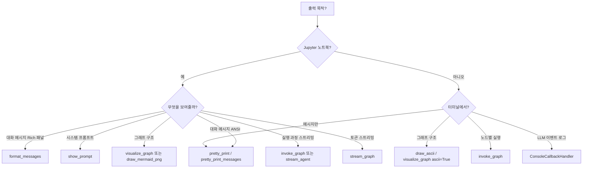

# 출력 포맷 가이드 (LangChain + util)

LangGraph·LangChain 실행 결과를 **보기 좋게** 보여 주는 API 정리입니다.  
**LangChain / LangGraph가 기본 제공하는 함수**와, 이 레포의 **`util/` 래퍼**를 구분해 두었습니다.

| 목적                             | 1순위 (기본 제공)                        | 이 레포 (`util` / `base`)               |
| -------------------------------- | ---------------------------------------- | --------------------------------------- |
| 단일·여러 메시지를 터미널에 보기 | `BaseMessage.pretty_print()`             | `pretty_print_messages` (동일 API 루프) |
| 메시지를 문자열로만 받기         | `pretty_repr()`, `get_buffer_string()`   | `format_message_content` (Rich용)       |
| 노트북에서 대화·프롬프트 패널    | —                                        | `format_messages`, `show_prompt`        |
| 그래프 노드 구조 (PNG/ASCII)     | `get_graph().draw_*`                     | `visualize_graph`, `show_graph()`       |
| 그래프 실행 노드별 스트리밍      | `graph.stream` + 직접 처리               | `invoke_graph`, `stream_graph`          |
| 메시지 dict 직렬화·복원          | `messages_to_dict`, `messages_from_dict` | —                                       |
| LLM 호출 이벤트 로그             | `ConsoleCallbackHandler`                 | —                                       |
| 메시지 내부 필드 트리 디버깅     | —                                        | `display_message_tree`                  |

**의존성**

- **LangChain Core**: `pretty_print` / `pretty_repr` (ANSI·Rich 호환 repr)
- **LangGraph**: Mermaid PNG (`draw_mermaid_png`, 추가 패키지 필요할 수 있음)
- **`util.messages_in_jupyter`**: [rich](https://github.com/Textualize/rich)
- **`util.graphs`**: Jupyter ZMQ 셸 + `IPython.display`

---

## 0. LangChain / LangGraph 기본 제공

패키지: **`langchain-core`** (메시지), **`langgraph`** (그래프 그리기).  
별도 import 없이 메시지 객체·컴파일 그래프에서 바로 쓸 수 있습니다.

### `BaseMessage.pretty_print()`

메시지 **한 건**을 구분선·제목이 있는 블록으로 **stdout에 출력**합니다.  
`HumanMessage`, `AIMessage`, `ToolMessage`, `AIMessageChunk` 등 모든 `BaseMessage` 서브클래스에서 동일합니다.

```python
from langchain_core.messages import AIMessage, HumanMessage, ToolMessage

HumanMessage(content="3.1 * 4.2는 얼마입니까?").pretty_print()

ai = AIMessage(
    content="",
    tool_calls=[
        {"name": "calculator", "args": {"operation": "multiply", "a": 3.1, "b": 4.2}, "id": "call_1", "type": "tool_call"}
    ],
)
ai.pretty_print()  # Tool Calls 블록 포함

ToolMessage(content="13.02", tool_call_id="call_1", name="calculator").pretty_print()
```

**출력 형태 (요지)**

```text
================================== Ai Message ==================================
Tool Calls:
  calculator (call_1)
  Args:
    operation: multiply
    ...
```

| 항목      | 설명                                 |
| --------- | ------------------------------------ |
| 출력 대상 | 터미널 / 노트북 stdout (ANSI)        |
| 반환값    | 없음                                 |
| Rich 패널 | 없음 (`util.format_messages`와 대비) |

**여러 메시지**

```python
for m in result["messages"]:
    m.pretty_print()
```

이 레포의 `util.messages.pretty_print_messages`는 위 루프와 동일합니다.

---

### `BaseMessage.pretty_repr(html=False) -> str`

출력하지 않고 **포맷된 문자열**만 반환합니다. 로깅·파일 저장·노트북에서 `display`에 넘길 때 사용합니다.

```python
from langchain_core.messages import HumanMessage

msg = HumanMessage(content="안녕하세요")
text = msg.pretty_repr()           # 일반 텍스트
html = msg.pretty_repr(html=True)  # HTML 태그 포함 (노트북 display용)

print(text)
```

| `html`         | 용도                                    |
| -------------- | --------------------------------------- |
| `False` (기본) | 터미널·로그                             |
| `True`         | Jupyter `IPython.display.HTML(html)` 등 |

---

### `get_buffer_string(messages, ...) -> str`

메시지 시퀀스를 **하나의 평문 문자열**로 이어 붙입니다. 프롬프트 미리보기·단순 로그에 적합합니다.

```python
from langchain_core.messages import HumanMessage, AIMessage
from langchain_core.messages.utils import get_buffer_string

messages = [
    HumanMessage("3.1 * 4.2는?"),
    AIMessage("13.02입니다."),
]

# 기본: "Human: ...\nAI: ..."
print(get_buffer_string(messages))

# XML 스타일 (일부 모델 프롬프트 형식)
print(get_buffer_string(messages, format="xml"))
```

| 인자                | 기본값     | 설명                     |
| ------------------- | ---------- | ------------------------ |
| `human_prefix`      | `"Human"`  | `HumanMessage` 앞 접두사 |
| `ai_prefix`         | `"AI"`     | `AIMessage` 앞 접두사    |
| `system_prefix`     | `"System"` | `SystemMessage`          |
| `tool_prefix`       | `"Tool"`   | `ToolMessage`            |
| `message_separator` | `"\n"`     | 메시지 사이 구분         |
| `format`            | `"prefix"` | `"prefix"` 또는 `"xml"`  |

**반환값**: `str` (출력은 하지 않음 → `print(...)` 필요).

---

### `message_to_dict` / `messages_to_dict`

메시지를 **직렬화 가능한 dict**로 변환합니다. 노트북에서 구조를 그대로 보거나 JSON으로 저장할 때 사용합니다.

```python
from langchain_core.messages import messages_to_dict, message_to_dict

# 리스트 전체
messages_to_dict(result["messages"])

# 단일 메시지
message_to_dict(result["messages"][-1])
```

반환 형태: `[{"type": "human"|"ai"|"tool"|..., "data": {...}}, ...]`

`01-AgentState.ipynb`에서 `result["messages"]` 구조 확인용으로 쓰는 패턴과 동일합니다.

---

### `messages_from_dict` / `convert_to_messages`

dict·튜플·문자열 등을 **`BaseMessage` 리스트**로 되돌립니다 (출력 함수는 아니지만 짝으로 자주 씀).

```python
from langchain_core.messages import messages_from_dict
from langchain_core.messages.utils import convert_to_messages

restored = messages_from_dict(messages_to_dict(result["messages"]))

# invoke 입력용: role dict도 변환 가능
convert_to_messages([{"role": "user", "content": "안녕"}])
```

---

### LangGraph — `CompiledStateGraph.get_graph()` + `draw_*`

컴파일된 그래프에서 **노드·엣지 구조**를 그립니다.  
이 레포의 `util.graphs.visualize_graph`는 아래 API를 Jupyter/터미널에 맞게 감싼 것입니다.

```python
from IPython.display import Image, display
from deep_agents_from_scratch.SampleAgnetState import SampleAgnetState

agent = SampleAgnetState()
g = agent.graph.get_graph()          # xray=False
g_xray = agent.graph.get_graph(xray=True)  # 서브그래프·내부 노드 노출

# 터미널 ASCII
print(g.draw_ascii())
g.print_ascii()

# Mermaid 소스 (문자열)
mermaid_src = g.draw_mermaid()

# Jupyter: PNG (pygraphviz 등 추가 의존성 필요할 수 있음)
display(Image(g.draw_mermaid_png(background_color="white")))
```

| 메서드                           | 설명                                        |
| -------------------------------- | ------------------------------------------- |
| `draw_ascii()` / `print_ascii()` | 터미널용 ASCII 다이어그램                   |
| `draw_mermaid()`                 | Mermaid 문법 문자열                         |
| `draw_mermaid_png(...)`          | PNG 바이트 (`IPython.display.Image`에 전달) |
| `draw_png()`                     | (환경에 따라) 대체 PNG API                  |

**이 레포에서의 권장**

```python
from util.graphs import visualize_graph

visualize_graph(agent.graph)              # Jupyter → PNG, 터미널 → ASCII
visualize_graph(agent.graph, xray=True)
visualize_graph(agent.graph, ascii=True)  # 강제 ASCII
```

---

### `ConsoleCallbackHandler` / `StdOutCallbackHandler`

LLM·도구 **호출 이벤트**를 콘솔에 스트리밍합니다. 메시지 블록 형태가 아니라 **실행 트레이스**에 가깝습니다.

```python
from langchain.chat_models import init_chat_model
from langchain_core.tracers.stdout import ConsoleCallbackHandler

model = init_chat_model("openai:gpt-4o-mini")
response = model.invoke(
    "안녕",
    config={"callbacks": [ConsoleCallbackHandler()]},
)
```

```python
from langchain_core.callbacks.stdout import StdOutCallbackHandler

# 색상 지정 가능 (터미널 ANSI)
handler = StdOutCallbackHandler(color="green")
```

| 핸들러                   | 모듈                              | 용도                        |
| ------------------------ | --------------------------------- | --------------------------- |
| `ConsoleCallbackHandler` | `langchain_core.tracers.stdout`   | 체인/LLM 단계별 트레이스    |
| `StdOutCallbackHandler`  | `langchain_core.callbacks.stdout` | stdout으로 토큰·이벤트 출력 |

에이전트·그래프 실행 시:

```python
agent.invoke(inputs, config={"callbacks": [ConsoleCallbackHandler()]})
```

---

### LangChain 기본 vs 이 레포 `util` (메시지)

| 기능                | LangChain                              | 이 레포                                      |
| ------------------- | -------------------------------------- | -------------------------------------------- |
| 터미널 ANSI 블록    | `msg.pretty_print()`                   | `pretty_print_messages` (= 동일 루프)        |
| 문자열만            | `pretty_repr()`, `get_buffer_string()` | `format_message_content` (툴 call JSON 정리) |
| Jupyter Rich 패널   | 없음 (직접 `Panel` 구성)               | `format_messages`                            |
| 프롬프트 하이라이트 | 없음                                   | `show_prompt`                                |
| 그래프 PNG 래퍼     | `draw_mermaid_png` 직접                | `visualize_graph`                            |
| 노드별 실행 로그    | `stream` 직접 파싱                     | `invoke_graph`                               |

---

## 1. Jupyter — Rich 패널 (`util/messages_in_jupyter.py`)

노트북 셀에서 **Human / AI / Tool** 메시지를 색 테두리 패널로 출력합니다.  
`01-AgentState.ipynb` 등에서 `format_messages(result["messages"])` 형태로 사용합니다.

### `format_messages(messages)`

메시지 리스트를 순회하며 타입별 패널을 출력합니다.

| 메시지 타입    | 패널 제목      | 테두리 색 |
| -------------- | -------------- | --------- |
| `HumanMessage` | 🧑 Human       | blue      |
| `AIMessage`    | 🤖 Assistant   | green     |
| `ToolMessage`  | 🔧 Tool Output | yellow    |
| 그 외          | 📝 {타입명}    | white     |

**지원 내용**

- 문자열 `content`
- Anthropic 스타일 리스트 content (`type: text` / `tool_use`)
- OpenAI 스타일 `message.tool_calls` (args JSON 들여쓰기)

```python
from deep_agents_from_scratch.SampleAgnetState import SampleAgnetState
from util.messages_in_jupyter import format_messages

agent = SampleAgnetState()
result = agent.invoke(
    inputs={"messages": [{"role": "user", "content": "3.1 * 4.2는 얼마입니까?"}]}
)
format_messages(result["messages"])
```

**반환값**: 없음 (`None`). 출력만 합니다.

---

### `format_message(messages)`

`format_messages`의 **별칭**(하위 호환). 인자·동작 동일.

```python
from util.messages_in_jupyter import format_message

format_message(result["messages"])
```

---

### `format_message_content(message)`

단일 메시지를 **문자열**로만 변환합니다. 패널은 출력하지 않습니다.  
커스텀 UI나 로그에 붙일 때 사용합니다.

```python
from langchain_core.messages import AIMessage
from util.messages_in_jupyter import format_message_content

text = format_message_content(AIMessage(content="안녕하세요"))
print(text)
```

---

### `show_prompt(prompt_text, title="Prompt", border_style="blue")`

시스템 프롬프트·지침 문자열을 Rich 패널로 표시합니다.

- XML 태그 `<...>`: 굵은 파란색
- `## 헤더`: 굵은 마젠타
- `### 소제목`: 굵은 시안

```python
from util.messages_in_jupyter import show_prompt

SYSTEM = """You are a helpful assistant.
## Guidelines
Use tools when needed.
"""
show_prompt(SYSTEM, title="System Prompt", border_style="green")
```

---

### `stream_agent(agent, query, config=None)` (async)

에이전트를 `astream`으로 돌리며, **updates** 모드에서 `messages` 키가 있으면 노드마다 `format_messages`를 호출합니다.

```python
import asyncio
from util.messages_in_jupyter import stream_agent

async def main():
    state = await stream_agent(
        agent.graph,
        {"messages": [{"role": "user", "content": "요약해줘"}]},
        config={"recursion_limit": 20},
    )
    return state

# asyncio.run(main())  # 노트북에서는 await stream_agent(...)
```

| 스트림 모드 | 동작                                      |
| ----------- | ----------------------------------------- |
| `updates`   | Graph/Node 이름 출력 후 `format_messages` |
| `values`    | 마지막 상태를 `current_state`에 갱신      |

**반환값**: 마지막 `values` 이벤트의 상태 dict.

---

## 2. 그래프 구조 시각화 (`util/graphs.py`)

### `visualize_graph(graph, xray=False, ascii=False)`

`CompiledStateGraph`의 **노드·엣지 구조**를 표시합니다.

| 환경                              | 기본 동작                            |
| --------------------------------- | ------------------------------------ |
| Jupyter / VS Code 노트북 (ZMQ 셸) | Mermaid → **PNG 이미지** (`display`) |
| 일반 터미널 `python script.py`    | **ASCII** 다이어그램 (`print`)       |
| `ascii=True`                      | 항상 ASCII만                         |

```python
from deep_agents_from_scratch.SampleAgnetState import SampleAgnetState
from util.graphs import visualize_graph

g = SampleAgnetState()
visualize_graph(g.graph)

# 내부 서브그래프까지 펼치기
visualize_graph(g.graph, xray=True)

# 터미널에서 강제 ASCII
visualize_graph(g.graph, ascii=True)
```

**`BaseGraph`와 함께**

```python
from feature.SimpleChatBot import SimpleChatBot

bot = SimpleChatBot()
bot.show_graph()       # xray=False
bot.show_graph(xray=True, ascii=False)
```

`show_graph()`는 `util.graphs.visualize_graph(self._graph, ...)`를 호출합니다.

PNG 실패 시 ASCII로 자동 대체하며, 실패 메시지를 stdout에 출력합니다.

---

## 3. 그래프 실행 스트리밍 출력 (`util/messages.py`)

노드가 바뀔 때마다 구분선과 **🔄 Node: {이름}** 헤더를 출력합니다.  
`BaseGraph.invoke()` / `BaseGraph.stream()`이 내부에서 `invoke_graph` / `stream_graph`를 사용합니다.

### `invoke_graph(graph, inputs, config=None, *, ...)`

**동기** 실행 + 노드별 예쁜 출력. `stream_mode=["updates", "values"]`를 사용합니다.

```python
from util.messages import invoke_graph
from deep_agents_from_scratch.SampleAgnetState import SampleAgnetState

agent = SampleAgnetState()
inputs = {"messages": [{"role": "user", "content": "2 + 3은?"}]}

last_state = invoke_graph(agent.graph, inputs, config={"recursion_limit": 20})
# last_state: 마지막 values 스냅샷 (dict) 또는 None
```

| 인자         | 설명                                               |
| ------------ | -------------------------------------------------- |
| `node_names` | 지정 시 해당 노드만 출력 (빈 리스트 = 전체)        |
| `callback`   | `{"node", "content"}` dict를 받는 커스텀 출력 함수 |
| `subgraphs`  | 서브그래프 updates 포함 여부 (기본 `True`)         |
| `context`    | LangGraph 정적 컨텍스트                            |

**출력 예시 (요지)**

```
==================================================
🔄 Node: model 🔄
- - - - - - - - - - - - - - - - - - - - - - - - -
================================== Ai Message ==================================
...
==================================================
```

서브그래프 안 노드는 `Node: chatbot in [subagent_name]` 형태로 네임스페이스가 표시됩니다.

---

### `stream_graph(graph, inputs, config=None, *, ...)`

**토큰 단위** 메시지 스트리밍 (`stream_mode="messages"`). LLM 응답이 한 글자씩 이어져 출력됩니다.

```python
from util.messages import stream_graph

stream_graph(
    agent.graph,
    {"messages": [{"role": "user", "content": "짧게 인사해줘"}]},
    node_names=[],  # 비우면 모든 노드
)
```

노드가 바뀔 때만 구분선을 다시 출력합니다.

---

### `ainvoke_graph` / `astream_graph` (async)

`invoke_graph` / `stream_graph`의 **비동기** 버전. 시그니처·출력 형식은 동기판과 유사합니다.

```python
import asyncio
from util.messages import ainvoke_graph

async def run():
    return await ainvoke_graph(agent.graph, inputs)

# asyncio.run(run())
```

---

### `pretty_print_messages(messages)`

LangChain **`BaseMessage.pretty_print()`** 를 메시지마다 호출하는 얇은 래퍼입니다.  
LangChain을 직접 써도 되고, import 한 곳만 쓰고 싶을 때 `util`을 씁니다.

```python
# LangChain 직접 사용 (동일 결과)
for m in result["messages"]:
    m.pretty_print()

# util 래퍼
from util.messages import pretty_print_messages

pretty_print_messages(result["messages"])
```

---

### `display_message_tree(message)`

메시지·dict·list를 **깊이별 색상** 트리로 stdout에 출력합니다 (디버깅용).

```python
from util.messages import display_message_tree

display_message_tree(result["messages"][-1])
display_message_tree({"foo": {"bar": [1, 2]}})
```

`BaseMessage`면 `__dict__`를 펼쳐 필드를 계층적으로 보여 줍니다.

---

### `stream_response(response, return_output=False)`

LLM **응답 이터러블**을 받아 청크를 즉시 `print`합니다. LangGraph와 무관하게 단순 스트리밍 UI에 사용합니다.

```python
from util.messages import stream_response

# response: AIMessageChunk 또는 str 이터러블
answer = stream_response(model.stream(messages), return_output=True)
```

---

### `extract_token_probabilities(response)`

`model.bind(logprobs=True)` 응답에서 토큰별 확률을 **표 형태**로 출력하고 dict로 반환합니다.

```python
from util.messages import extract_token_probabilities

logprobs_model = model.bind(logprobs=True)
response = logprobs_model.invoke(messages)
stats = extract_token_probabilities(response)
# stats: {"tokens": [...], "probabilities": [...]}
```

logprobs가 없으면 경고 메시지를 출력하고 빈 리스트를 반환합니다.

---

### 에이전트 스트림 파서 (레거시 콜백)

`AgentStreamParser` + `AgentCallbacks` (`tool_callback`, `observation_callback`, `result_callback`)는  
구형 에이전트 스텝 dict를 단계별로 `[도구 호출]` / `[관찰 내용]` / `[최종 답변]` 라벨과 함께 출력합니다.  
새 노트북·튜토리얼에서는 `invoke_graph` / `format_messages` 사용을 권장합니다.

---

## 4. 어떤 함수를 쓸까?



| 상황                                      | LangChain / LangGraph                             | 이 레포 (`util` / `base`)            |
| ----------------------------------------- | ------------------------------------------------- | ------------------------------------ |
| `invoke` 결과 `messages` (노트북, 패널)   | —                                                 | `format_messages`                    |
| `invoke` 결과 `messages` (터미널, 빠르게) | `m.pretty_print()`                                | `pretty_print_messages`              |
| 메시지를 한 줄 로그 문자열로              | `get_buffer_string()`                             | —                                    |
| 메시지 dict로 구조 확인                   | `messages_to_dict()`                              | —                                    |
| 프롬프트 전문 확인                        | —                                                 | `show_prompt`                        |
| 컴파일된 그래프 구조                      | `get_graph().draw_mermaid_png()` / `draw_ascii()` | `visualize_graph`, `show_graph()`    |
| 노드별 중간 상태 스트리밍                 | `graph.stream(...)` 직접                          | `invoke_graph`, `BaseGraph.invoke()` |
| LLM 토큰 실시간                           | `stream_mode="messages"`                          | `stream_graph`                       |
| 메시지 `__dict__` 디버깅                  | `pretty_repr()` 또는 dict 출력                    | `display_message_tree`               |
| 체인/LLM 호출 트레이스                    | `ConsoleCallbackHandler`                          | —                                    |

---

## 5. `BaseGraph`와의 연결

```python
from feature.SimpleToolNode import SimpleToolNode

workflow = SimpleToolNode()

# 구조
workflow.show_graph()

# 실행 (내부에서 invoke_graph → 노드별 포맷 출력)
workflow.invoke(inputs={"messages": [("user", "검색해줘")]})

# 스트리밍
workflow.stream(inputs={"messages": [("user", "안녕")]})
```

`invoke` / `stream`의 `node_names`, `callback` 인자는 `util.messages`의 동명 인자와 같습니다.

---

## 6. import 치트시트

```python
# --- LangChain Core (메시지) ---
from langchain_core.messages import (
    AIMessage,
    HumanMessage,
    ToolMessage,
    message_to_dict,
    messages_from_dict,
    messages_to_dict,
)
from langchain_core.messages.utils import convert_to_messages, get_buffer_string

# pretty_print / pretty_repr: 메서드 (import 불필요)
# msg.pretty_print()
# text = msg.pretty_repr(html=False)

# --- LangChain (콜백 트레이스) ---
from langchain_core.tracers.stdout import ConsoleCallbackHandler
from langchain_core.callbacks.stdout import StdOutCallbackHandler

# --- LangGraph (그래프 그리기, Jupyter) ---
from IPython.display import Image, display
# g = compiled.get_graph(xray=False)
# display(Image(g.draw_mermaid_png()))

# --- 이 레포 util ---
from util.messages_in_jupyter import (
    format_messages,
    format_message,
    format_message_content,
    show_prompt,
    stream_agent,
)
from util.graphs import visualize_graph
from util.messages import (
    invoke_graph,
    stream_graph,
    ainvoke_graph,
    astream_graph,
    pretty_print_messages,
    display_message_tree,
    stream_response,
    extract_token_probabilities,
)
```

---

## 7. 관련 파일·패키지

| 위치                                         | 역할                                                        |
| -------------------------------------------- | ----------------------------------------------------------- |
| `langchain_core.messages`                    | `BaseMessage.pretty_print`, `pretty_repr`                   |
| `langchain_core.messages`                    | `messages_to_dict`, `message_to_dict`, `messages_from_dict` |
| `langchain_core.messages.utils`              | `get_buffer_string`, `convert_to_messages`                  |
| `langchain_core.tracers.stdout`              | `ConsoleCallbackHandler`                                    |
| `langgraph` (`CompiledStateGraph.get_graph`) | `draw_ascii`, `draw_mermaid`, `draw_mermaid_png`            |
| `util/messages_in_jupyter.py`                | Rich 패널, `stream_agent`                                   |
| `util/graphs.py`                             | `visualize_graph`, `GRAPH_NODE_STYLES`                      |
| `util/messages.py`                           | `invoke_graph`, `stream_graph`, 트리·토큰 출력 등           |
| `base/graph_structure_image.py`              | `BaseGraph.show_graph()` 구현                               |
| `base/base_graph.py`                         | `invoke` / `stream` → `util.messages` 위임                  |

`deep_agents_from_scratch/notebooks_original/utils.py`는 예전 노트북용 복사본이며, **새 코드는 `util.messages_in_jupyter` + LangChain `pretty_print` / `messages_to_dict`를 조합** 하면 됩니다.

**공식 문서**

- [LangChain Messages](https://python.langchain.com/docs/concepts/messages/)
- [LangGraph Graph API (시각화)](https://langchain-ai.github.io/langgraph/reference/graphs/)
